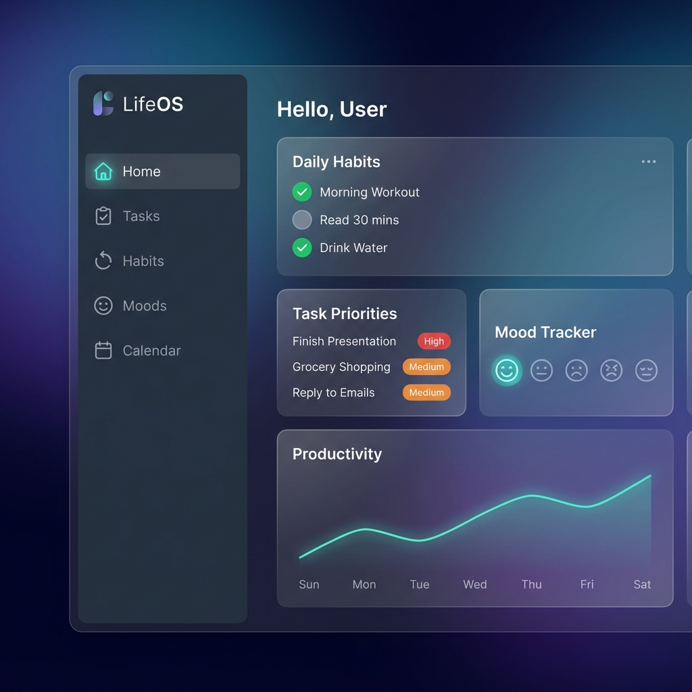

# LifeOS - Personal Digital Life Dashboard

**LifeOS** is a comprehensive personal dashboard designed to bring clarity to your daily life. It unifies task management, habit tracking, mood journaling, and detailed analytics into one calm, beautiful interface.



## ✨ Key Features

### 🎯 Smart Task Management
- **Organize**: Create, edit, and delete daily tasks.
- **Prioritize**: Tag tasks with High, Medium, or Low priority.
- **Categories**: Sort tasks by Personal, Work, Health, etc.

### ⚡ Habit Tracking
- **Streak System**: Visualize your consistency with daily streaks.
- **Detailed History**: View completion history for the last 7 days.
- **Motivation**: Interactive completion animations.

### 😌 Mood & Wellness
- **Daily Check-in**: Track your mood on a 5-point scale.
- **Journaling**: (Coming soon) Add notes to your mood entries.
- **Insights**: See how your mood correlates with your productivity.

### 📊 Analytics & Insights
- **Productivity Score**: Calculated real-time based on task completion and habit consistency.
- **Visual Charts**: Beautiful data visualization for easy understanding.
- **Hydration Tracker**: Specific widget to track daily water intake (Goal: 8/day).

### 🎨 Customizable Experience
- **Dark/Light Mode**: Fully supported system-wide theming.
- **Profile Management**: Upload custom avatars and update user details.
- **Responsive Design**: Works on Desktop and Tablets.

---

## 🛠️ Technology Stack

### Frontend (Client)
- **Framework**: [Next.js 15](https://nextjs.org/) (App Router)
- **Language**: TypeScript
- **Styling**: Tailwind CSS
- **Animations**: Framer Motion
- **Icons**: Lucide React

### Backend (Server)
- **Runtime**: Node.js
- **Framework**: Express.js
- **Database**: MongoDB (Mongoose ODM)
- **Authentication**: JWT & BCrypt

---

## 🚀 Getting Started

### Prerequisites
- Node.js (v18+)
- MongoDB (Local or Atlas)
- Git

### Installation

1. **Clone the repository**
   ```bash
   git clone https://github.com/Pruthivi13/LifeOS.git
   cd LifeOS
   ```

2. **Setup Backend**
   ```bash
   cd server
   npm install
   # Create .env file with:
   # PORT=5000
   # TASKS_DB_URI=your_mongodb_uri
   # JWT_SECRET=your_secret
   npm run dev
   ```

3. **Setup Frontend**
   ```bash
   cd ../client
   npm install
   npm run dev
   ```

4. **Access the App**
   Open [http://localhost:3000](http://localhost:3000) in your browser.

---

## 📂 Project Structure

```
LifeOS/
├── client/           # Next.js Frontend
│   ├── src/app/      # Pages & Layouts
│   ├── src/components/ # Reusable UI Components
│   └── ...
└── server/           # Express Backend
    ├── src/models/   # Mongoose Schemas
    ├── src/routes/   # API Routes
    └── src/controllers/
```
## 📄 License

MIT License. Built with ❤️ for productivity.
